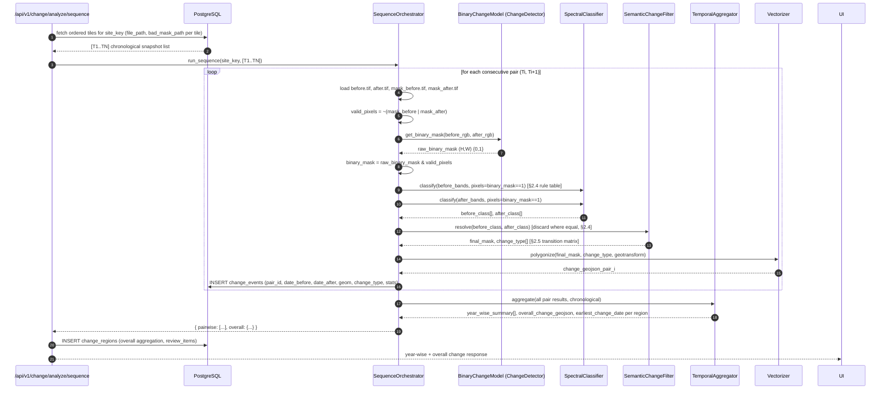

# 🛰️ PART 2 — Phase B: Semantic-Verified Binary Change Engine (Detailed)

## 2.1 Purpose
Take the ordered tile sequence Phase A hands off (N snapshots for one `site_key`) and produce
classified, dated, semantically-verified change output: per-pair (year-wise) change polygons
tagged with a change type, plus an overall aggregated change map with an
**earliest-supported-date** per changed region.

---

## 2.2 Core Design Rules

1. **Never diff raw pixel reflectance values** to decide *what* changed. Differencing is fragile
   to illumination angle, seasonal phenology, and sensor drift — it can only tell you "something
   is different here," never *what kind* of surface transition happened.
2. **The binary ChangeFormer model decides *where*.** It outputs a 0/1 mask per pixel and nothing
   else — it never assigns a change type.
3. **NDVI / NDWI / NDBI decide *what*.** Computed **independently** on the before-tile and the
   after-tile — two separate, self-contained land-cover classifications, compared afterward.
   Never subtracted from each other.
4. **Semantic contradiction = false positive.** If the binary model flags a pixel as changed but
   both the before-classification and after-classification land in the same class (e.g. both
   "Dense Vegetation" — a common failure mode from leaf-on/leaf-off seasonal effects), the pixel
   is discarded. This is the model-correction step that keeps seasonal noise out of your final
   change map.
5. **Cloud/bad pixels are excluded everywhere.** `.mask.tif` for *both* tiles in a pair gates the
   pixel out before the binary model result is even trusted, and again before classification.
6. **N snapshots → N−1 sequential pairs**, chained: `(T1,T2), (T2,T3), (T3,T4)…` — never a single
   first-vs-last diff. This chaining is what makes "earliest supported observation" answerable.

---

## 2.3 Standard NDVI / NDWI / NDBI Ranges

All three indices are ratio-based and mathematically bounded to **[-1, +1]**. Below are the
commonly-cited literature conventions for each — these are the *standard* reference ranges to
calibrate your thresholds against, not numbers invented for this project. Sentinel-2 reflectance
values can shift these boundaries slightly depending on atmospheric correction and season, so
treat these as the standard starting point and fine-tune against your own AeroLens tiles if the
classifier misfires on real data.

### NDVI — Normalized Difference Vegetation Index `(NIR−Red)/(NIR+Red)`
A generalized land-cover interpretation (commonly adapted from USGS-style NDVI reference tables):

| NDVI Range | Land Cover |
|---|---|
| ≤ 0.1 | Water, barren land, sand, rock, snow, built-up (no vegetation signal) |
| 0.2 – 0.5 | Grassland, shrub, cropland — sparse to moderate vegetation |
| 0.6 – 0.9 | Dense, healthy vegetation (forest canopy) |

Negative NDVI (toward −1) is typically clouds, water, or snow; near-zero is bare soil/rock/urban;
positive and rising values track vegetation vigor and density.

### NDWI — Normalized Difference Water Index `(Green−NIR)/(Green+NIR)` (McFeeters, 1996)
| NDWI Range | Land Cover |
|---|---|
| > 0.3 | Open water bodies (values above ~0.5 = high-confidence pure water) |
| 0.0 – 0.2 | Built-up surfaces (NDWI is known to be sensitive to built structures — a documented limitation, not a bug in your logic — which is exactly why NDBI is used alongside it below) |
| < 0 | Vegetation and soil (non-water) |

### NDBI — Normalized Difference Built-up Index `(SWIR−NIR)/(SWIR+NIR)` (Zha et al., 2003)
| NDBI Range | Land Cover |
|---|---|
| > 0 | Built-up / urban surfaces (higher = more built-up) |
| ≤ 0, moderately negative | Vegetation |
| Strongly negative | Water bodies |

**Why combine all three instead of using NDWI alone for water:** the literature is explicit that
NDWI alone is *insensitive to distinguishing water from built-up* — both can produce
weakly-positive-to-neutral NDWI. NDBI resolves that ambiguity because built-up areas score
strongly positive on NDBI while water scores strongly negative. This is exactly why the priority
rule table below checks NDBI as a confirming condition for the Water class, not NDWI in
isolation.

---

## 2.4 Combined Classification Rule Set (per pixel, per tile)

Applied **independently** to the before-tile and the after-tile, evaluated top-to-bottom (first
match wins to avoid ambiguous double-labeling), and only computed for pixels where
`binary_mask == 1` — full-tile classification is never needed, which keeps this step cheap.

| Priority | Class | Condition |
|---|---|---|
| 1 | **Water** | `NDWI > 0.3` AND `NDBI < -0.1` *(NDBI confirms it isn't built-up)* |
| 2 | **Dense Vegetation** | `NDVI > 0.6` AND `NDBI < 0` |
| 3 | **Moderate / Sparse Vegetation** | `0.2 ≤ NDVI ≤ 0.5` AND `NDBI < 0` |
| 4 | **Built-up / Urban** | `NDBI > 0` AND `NDVI ≤ 0.2` |
| 5 | **Bare Soil / Barren** | `NDVI ≤ 0.1` AND `NDBI ≤ 0` AND `NDWI ≤ 0` |
| 6 | **Unclassified / Transitional** | none of the above — kept, flagged low-confidence |

This is one fully vectorized `numpy` function operating on the `(K,)` array of the `K` pixels
flagged by the binary mask — no per-pixel Python loop.

### Worked example (yours)
- **Before**: `NDVI 0.917, NDBI −0.898, NDWI −0.8` → rule 2 (`NDVI>0.6`, `NDBI<0`) → **Dense
  Vegetation** (rendered green)
- **After**: `NDVI −0.091, NDBI 0.115, NDWI −0.035` → rule 4 (`NDBI>0`, `NDVI≤0.2`) → **Bare
  Soil/Built-up boundary** (rendered brown/tending built-up)
- Before ≠ After → **real, kept change**

### False-positive example
- Before → Dense Vegetation (rule 2). After → Dense Vegetation (rule 2) again — e.g. the binary
  model tripped on a seasonal canopy-color shift that isn't a real land-cover change.
- Before == After → **discarded**, never reaches the output mask.

---

## 2.5 Change-Type Transition Matrix

Once a pixel survives the semantic filter (`before_class ≠ after_class`), the transition pair is
looked up to assign the problem-statement-required category:

| Before → After | Change Type |
|---|---|
| Vegetation (dense/moderate) → Built-up, or Bare Soil → Built-up | **Construction** |
| Vegetation → Bare Soil | **Clearance** |
| Water → Bare Soil / Vegetation | **Water-Extent Variation (shrinkage)** |
| Bare Soil / Vegetation → Water | **Water-Extent Variation (expansion)** |
| Built-up → Vegetation / Bare Soil | **Demolition / Reversion** |
| Built-up → Built-up, elongated polygon shape | **Road Development** (§2.5.1) |
| Anything else surviving the filter | **Unclassified Structural Change** |

### 2.5.1 Road Development — morphology sub-rule
NDBI alone can't separate "a new building" from "a new road" — both classify as Built-up. After
polygonizing a *Construction*-labeled connected component, run a cheap shape test:
`elongation_ratio = major_axis_length / minor_axis_length` via `skimage.measure.regionprops`. If
`elongation_ratio > 4` (thin and long, not blob-shaped), re-label that specific polygon **Road
Development** instead of generic Construction. This is one extra pass over already-small
connected components — no new model required.

---

## 2.6 End-to-End Flow



---

## 2.7 Module Layout

```text
backend/
├── services/
│   └── change_engine/
│       ├── __init__.py
│       ├── sequence_orchestrator.py     # drives the pairwise loop over N tiles
│       ├── binary_change_adapter.py     # thin wrapper around change_detector_module.ChangeDetector
│       ├── spectral_classifier.py       # §2.4 — vectorized NDVI/NDWI/NDBI rule table
│       ├── semantic_change_filter.py    # §2.4 — before==after false-positive discard
│       ├── change_type_rules.py         # §2.5 — transition matrix + road morphology sub-rule
│       ├── temporal_aggregator.py       # §2.9 — year-wise + overall union, earliest-date logic
│       └── vectorizer.py                # rasterio/shapely polygonize → GeoJSON
├── change_detector_module/              # your existing MTKD-ChangeFormer package, unmodified
│   ├── best_mIoU_iter_38000.pth
│   ├── detector.py
│   └── ...
└── api/routers/change.py                # extended with /analyze/sequence
```

`binary_change_adapter.py` stays a thin pass-through — it resolves tile IDs to RGB/TCI crops,
calls `ChangeDetector.get_binary_mask(before, after)` from your existing module, and returns the
raw `(H,W)` array. Isolating it means the ChangeFormer weights/config never need touching if you
swap models later.

---

## 2.8 API — `POST /api/v1/change/analyze/sequence`

Request:
```json
{
  "site_key": "site_34.1234_77.5678_a1b2c3d4",
  "tile_ids": [
    "scene_2014_tile_00012",
    "scene_2016_tile_00012",
    "scene_2019_tile_00012",
    "scene_2023_tile_00012"
  ]
}
```

Response:
```json
{
  "site_key": "site_34.1234_77.5678_a1b2c3d4",
  "pairwise": [
    {
      "date_before": "2014-06-15",
      "date_after": "2016-08-20",
      "change_pct": 4.1,
      "change_geojson": { "type": "FeatureCollection", "features": [ "...polygons tagged with change_type..." ] }
    },
    {
      "date_before": "2016-08-20",
      "date_after": "2019-03-02",
      "change_pct": 1.8,
      "change_geojson": { "...": "..." }
    }
  ],
  "overall": {
    "change_geojson": { "...": "union of all real changes across the timeline" },
    "change_type_breakdown": { "Construction": 62.0, "Clearance": 28.5, "Road Development": 9.5 },
    "earliest_change_regions": [
      { "region_id": "r1", "earliest_supported_date": "2016-08-20", "change_type": "Construction" }
    ]
  }
}
```

---

## 2.9 Database Additions

```sql
-- one row per (pair, connected-component polygon) — the granular truth
CREATE TABLE change_events (
    event_id        SERIAL PRIMARY KEY,
    site_key        TEXT NOT NULL,
    tile_before_id  TEXT NOT NULL,
    tile_after_id   TEXT NOT NULL,
    date_before     TIMESTAMP NOT NULL,
    date_after      TIMESTAMP NOT NULL,
    change_type     TEXT NOT NULL,          -- Construction / Clearance / Water-Extent Variation / Road Development / ...
    before_class    TEXT NOT NULL,
    after_class     TEXT NOT NULL,
    area_px         INT NOT NULL,
    geom            GEOMETRY(Polygon, 4326) NOT NULL,
    created_at      TIMESTAMP DEFAULT now()
);

-- one row per site_key — the aggregated, cross-pair answer
CREATE TABLE change_regions (
    region_id               SERIAL PRIMARY KEY,
    site_key                TEXT NOT NULL,
    change_type             TEXT NOT NULL,
    earliest_supported_date TIMESTAMP NOT NULL,   -- first pair in which this region appeared as real change
    geom                    GEOMETRY(Polygon, 4326) NOT NULL,
    created_at              TIMESTAMP DEFAULT now()
);
```

`earliest_supported_date` is the direct answer to "estimate the earliest available observation at
which the change is supported by usable imagery" — it falls straight out of walking the pairs
chronologically and recording the first pair index in which a given spatial region first survives
the semantic filter.

---

## 2.10 Temporal Aggregation Logic (`temporal_aggregator.py`)

1. **Year-wise**: each pair's `change_events` rows are already scoped to one `(date_before,
   date_after)` interval — this *is* the year-wise output, no extra work needed.
2. **Overall**: spatially union all surviving polygons across all pairs
   (`shapely.ops.unary_union`, grouped per `change_type`, or per overlapping cluster if mixed-type
   overlap should merge into one region).
3. **Earliest-observation**: for each unioned region, walk the pairs in chronological order and
   record the `date_after` of the *first* pair whose polygon intersects that region. Cloud-masked
   pairs can't contribute a false-early date, since their pixels were already excluded upstream
   via `valid_pixels`.
4. A region that appears in pair 1 but disappears (reverts) in a later pair is **not** silently
   dropped — keep both the "appeared" and the "reverted" as separate `change_events`, since
   reversion is itself a real change (e.g. temporary construction site → cleared again).

---

## 2.11 Implementation Phases

| Phase | Component | Key Deliverables |
|---|---|---|
| B1 | `binary_change_adapter.py` | Wrap `ChangeDetector` from your module; resolve tile IDs → RGB crops → binary mask array |
| B2 | `spectral_classifier.py` | Vectorized NDVI/NDWI/NDBI rule table (§2.4), unit-tested against your worked examples |
| B3 | `semantic_change_filter.py` | before==after discard rule; outputs surviving pixel indices |
| B4 | `change_type_rules.py` | Transition matrix + road elongation-ratio sub-rule (§2.5) |
| B5 | `vectorizer.py` | `rasterio.features.shapes` → `shapely` polygons → GeoJSON, tagged with `change_type` |
| B6 | `sequence_orchestrator.py` | Chains B1–B5 across all N−1 pairs for a site_key |
| B7 | `temporal_aggregator.py` | Year-wise passthrough + overall union + earliest-date logic (§2.10) |
| B8 | `change.py` router | New `/analyze/sequence` endpoint + `change_events`/`change_regions` DB writes |
| B9 | Tests | Unit tests per module (esp. B2/B3 against your two worked pixel examples) + one synthetic 4-tile end-to-end test |

Suggested build order: **B2 → B3 → B4 first** (pure numpy, no I/O, fastest to unit-test against
your exact worked examples), then **B1** (wire in the real model), then **B5–B8** (glue + API),
**B9** throughout.
